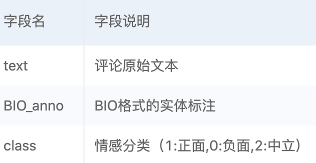
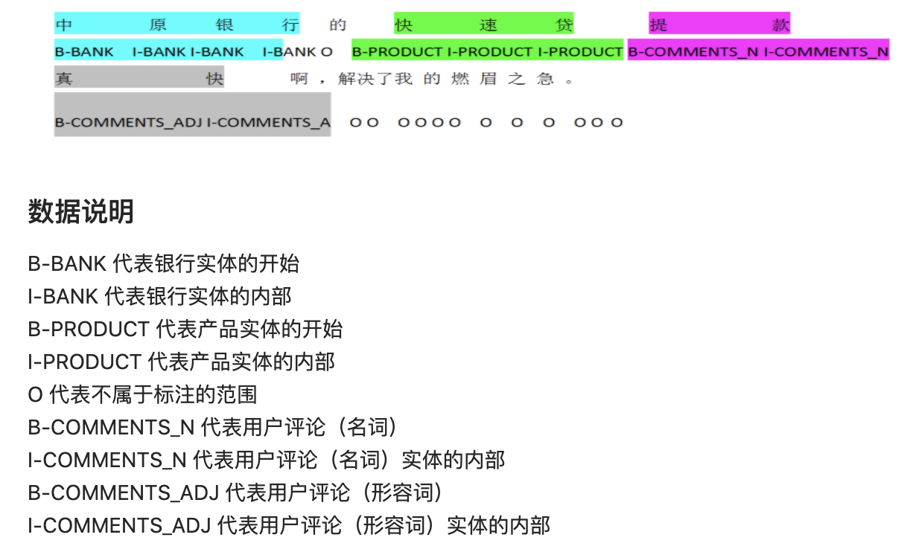

# 产品评论观点提取
## 1. 项目介绍
从非结构化的评论文本中提取标准化、结构化的信息，如产品名、评论维度、评论观点等；并通过自然语言处理的语义情感分析技术判断出一段银行产品评论文本的情感倾向。

## 2.数据说明
数据来源：知乎、理财贷款论坛、投资理财通、银行客服等公开评论文本。

训练数据说明：

实体标注采用BIO格式，即Begin, In, Out格式。一个标注的示例如下：

训练集总数据量为7528，各类别标签的数据量分布：

{"负面": 795, "正面": 288, "中立": 6445}

## 3.评论情感分类
- 我们基于预训练语言模型chinese-roberta-wwm-ext进行评论情感分类模型的开发。
- 主要训练参数如下(其中batch_size超过3之后会出现过拟合的情况)：
  - 随机种子：1024
  - 学习率：5e-5
  - batch_size：64
  - train_epochs：3
  - max_len：256
  - weight_decay：0.01
  - focal_loss_gamma：2
  - focal_loss_alpha：对中立标签的alpha权重设置为0.5，其他标签的alpha权重设置为1.0
- loss：由于中立标签的数据量较大，存在样本不均衡的情况，因此使用focal_loss进行损失计算

## 4.命名实体识别
- 基于BERT-CRF进行命名实体识别模型的开发
- 主要训练参数如下：
  - 随机种子：1024
  - 学习率：
    - BERT模型的学习率：1e-5
    - CRF模型的学习率：1e-4
  - batch_size：64
  - train_epochs：20
  - max_len：256
  - weight_decay：0.01
  - focal_loss_gamma：2
  - focal_loss_alpha：对O标签的alpha权重设置为0.5，其他标签的alpha权重设置为1.0
- loss：由于O标签的数据量较大，存在样本不均衡的情况，因此使用focal_loss进行损失计算
